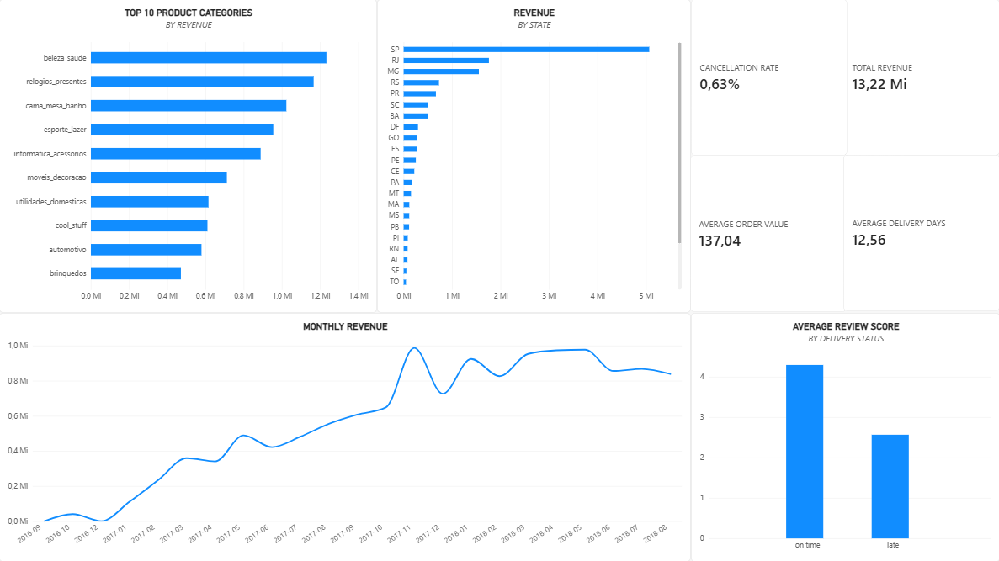

# retail sales analytics

this project uses the brazilian e-commerce public dataset by olist to explore what is happening behind the sales numbers: where revenue comes from, which categories carry the business, how delivery performance affects customer satisfaction and how often customers actually come back.

the idea was simple: treat the dataset like something i had received at work and build the analysis from there.

---

## dashboard

the dashboard brings together the main kpis and business findings from the analysis, including revenue, average order value, cancellations, delivery performance, product categories, geography and customer satisfaction.

---

## what i used

`postgresql` `sql` `pgadmin` `power bi`

---

## the dataset

the olist dataset is split across several tables instead of giving everything in one convenient spreadsheet.

that made it a good fit for practicing a more realistic analytics workflow.

the analysis uses data about:

* customers
* orders
* order items
* products
* sellers
* payments
* reviews
* product categories

the tables were loaded into postgresql and connected through their respective ids before the analysis started.

---

## what i wanted to know

i didn't want this project to become a collection of random charts, so i started with actual questions.

* how much revenue did delivered orders generate?
* what does the average order look like?
* how did sales evolve over time?
* which product categories generate the most revenue?
* where are the customers generating that revenue?
* how common are cancellations and late deliveries?
* does arriving late actually affect customer reviews?
* how many customers ever come back for another purchase?

the sql used to answer these questions is available in [`sql/01_sales_analysis.sql`](sql/01_sales_analysis.sql).

---

## what the data says

### sales

delivered orders generated **r$ 13,221,498.11** in product revenue, with an **average order value of r$ 137.04**.

the monthly series also shows a clear increase in activity throughout 2017, with the business reaching a much higher sales level by the end of the year.

### product mix

the five categories generating the most revenue were:

1. health & beauty
2. watches & gifts
3. bed, bath & table
4. sports & leisure
5. computers & accessories

rather than revenue being evenly distributed across the catalog, a relatively small group of categories sits at the top of the business.

### geography

são paulo is by far the largest market in the dataset, followed by rio de janeiro and minas gerais.

for a retail operation, that concentration matters. changes in demand, logistics or customer experience in those markets would have a disproportionate effect on overall performance.

### operations

the order flow is fairly healthy at first glance:

* **cancellation rate:** 0.63%
* **average delivery time:** 12.56 days
* **late delivery rate:** 8.11%

the more interesting part appears when delivery performance is connected to customer reviews.

### late deliveries hurt!

orders delivered on time received an average review score of **4.29**.

late orders averaged only **2.57**.

that's one of the clearest findings in the project. delivery delays are associated with a substantial drop in customer satisfaction, which makes logistics more than an operational metric. it directly affects the customer experience.

### customers rarely come back

only **3.00%** of customers made more than one delivered order.

that is a very small share of repeat buyers and points to one of the biggest business opportunities in the dataset: retention.

even without building a predictive model, this already raises useful follow-up questions around lifecycle marketing, post-purchase experience and repeat-purchase incentives.

---

## a few takeaways

if i had to reduce the project to three things worth paying attention to, they would be:

**delivery matters a lot.** late orders receive dramatically worse reviews.

**revenue is concentrated.** both geography and product categories show clear leaders.

**retention is weak.** only 3% of customers make another delivered purchase, leaving plenty of room for deeper customer analysis.

---

## what i'd explore next

there are a few directions i'd like to take this analysis further:

* cohort and retention analysis
* customer lifetime value
* seller performance
* freight cost and delivery time by region
* payment behavior
* a deeper look at what drives negative reviews

for now, this version focuses on building a clean end-to-end analytics workflow with postgresql, sql and power bi.
